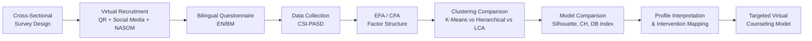
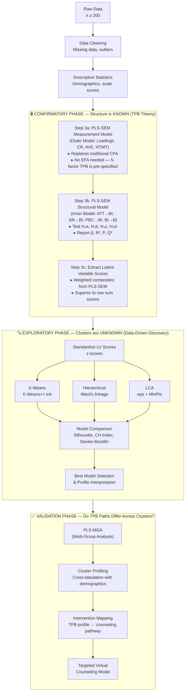
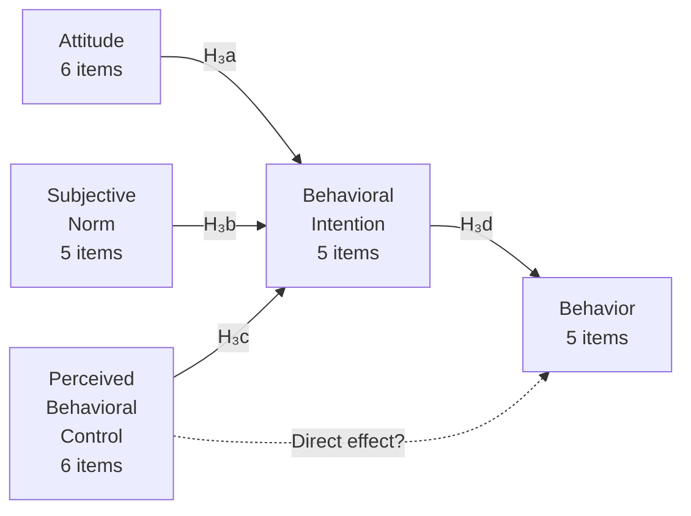

# 📊 Research Planning Guide
## Aligned with Your Master by Research PICOC

> **Thesis:** Comparison of Clustering Methods in Developing Virtual Counseling Model for Autism Caregiver

---

## Your PICOC Framework

| Element | Your Research | Notes |
|---|---|---|
| **P — Population** | Malaysian parents/caregivers of children with Autism Spectrum Disorder (ASD) | Recruited via virtual pipeline (QR codes, social media, NASOM networks) |
| **I — Intervention / Exposure** | Clustering-based caregiver profiling using CSI-PASD (TPB constructs: ATT, SN, PBC, BI, B) | 27-item CSI-PASD (TPB-validated instrument) |
| **C — Comparison** | K-Means Clustering vs. Hierarchical Clustering vs. LCA | Three distance-based clustering approaches compared |
| **O — Outcome** | (1) Distinct caregiver phenotypes/profiles identified, (2) Best-performing clustering method determined, (3) Targeted virtual counseling model with cluster-specific interventions | Precision mental health: tailored counseling pathways (Attitude-Focused, Norm-Focused, Control-Focused) |
| **C — Context** | Malaysian healthcare system — service gap, digital barriers, ASEAN policy context, NASOM/community NGO, telerehabilitation shift | Cultural factors: cultural stigma, logistical variables, bilingual (EN/BM) instrument |

---

## Phase 1: Research Foundation — Locked In

### 1.1 Your Research Objectives (From Manuscript)

| RO | Objective | Statistical Method |
|---|---|---|
| **RO1** | Identify distinct caregiver phenotypes in Malaysia through the integration of TPB constructs (attitude, subjective norm, perceived behavioral control), behavioral intention, and caregiver well-being data. | PLS-SEM (latent variable scores) → K-Means, Hierarchical Clustering, LCA |
| **RO2** | Perform a comparative analysis of clustering techniques — K-Means, Hierarchical (Agglomerative, Ward's linkage), and LCA — to determine the most robust method for caregiver stratification. | Model comparison: Silhouette, Calinski-Harabasz, Davies-Bouldin |
| **RO3** | Examine how Theory of Planned Behavior constructs vary across identified caregiver phenotypes and predict intention to engage with virtual counseling. | PLS-SEM (structural paths) + PLS-MGA (Multi-Group Analysis across clusters) |

### 1.2 Your Hypotheses (Mapped to ROs)

**RO1 — Identifying Caregiver Phenotypes:**

| Hypothesis | Statement | Test |
|---|---|---|
| **H₁** | There exist ≥2 statistically distinct caregiver profiles based on TPB latent variable scores | All three clustering methods |

**RO2 — Comparing Clustering Methods:**

| Hypothesis | Statement | Test |
|---|---|---|
| **H₂** | The three clustering methods (K-Means, Hierarchical, LCA) will produce meaningfully different cluster solutions in terms of internal validation metrics | Cross-method comparison via Silhouette, CH, Davies-Bouldin |

**RO3 — TPB Construct Variation Across Phenotypes:**

| Hypothesis | Statement | Test |
|---|---|---|
| **H₃a** | Attitude toward counseling-seeking has a significant positive effect on Behavioral Intention | PLS-SEM path coefficient (ATT → BI) |
| **H₃b** | Subjective Norm has a significant positive effect on Behavioral Intention | PLS-SEM path coefficient (SN → BI) |
| **H₃c** | Perceived Behavioral Control has a significant positive effect on Behavioral Intention | PLS-SEM path coefficient (PBC → BI) |
| **H₃d** | Behavioral Intention has a significant positive effect on actual help-seeking Behavior | PLS-SEM path coefficient (BI → B) |
| **H₃e** | The TPB structural path strengths differ significantly across caregiver clusters | PLS-MGA (Multi-Group Analysis) |

### 1.3 Your Paradigm

| Element | Your Position |
|---|---|
| **Paradigm** | Post-Positivist |
| **Ontology** | Critical realism — caregiver phenotypes exist but are imperfectly observable |
| **Epistemology** | Probabilistic — patterns are discovered through data-driven clustering, not directly measured |
| **Approach** | Quantitative cross-sectional survey design |

> [!TIP]
> Your paradigm is **Post-Positivist** because you acknowledge that caregiver "types" are hidden patterns that must be statistically discovered through clustering — not directly observed. This justifies why you need unsupervised learning methods (K-Means, Hierarchical, LCA) rather than just descriptive statistics.

---

## Phase 2: Literature Review — Your Danger Checklist

### 2.1 Specific Dangers for YOUR Thesis Topic

Your literature review covers a highly active, emotionally charged field (autism caregiving). This makes it **especially vulnerable** to certain dangers:

#### 🔴 Critical Dangers — Immediate Red Flags

| Danger | Why It's Especially Risky for Your Thesis | How to Check |
|---|---|---|
| **Predatory journals** | Autism caregiving is a popular topic — predatory journals flood this space with low-quality survey studies | Verify every journal in [DOAJ](https://doaj.org/) or Scopus/WoS. Check [Beall's List](https://beallslist.net/) |
| **Retracted articles** | Several high-profile autism papers have been retracted (e.g., Wakefield 1998 and its ripple effects) | Check [Retraction Watch](http://retractiondatabase.org/) for every source |
| **Paper mills** | Survey-based autism caregiver studies are easy to fabricate — watch for impossible sample sizes or suspiciously clean data | Cross-check author affiliations, verify institution exists |
| **Hijacked journals** | Some Malaysian and Southeast Asian journal websites have been hijacked | Verify URL against official publisher portal. Check [Retraction Watch's hijacked journal checker](https://retractionwatch.com/the-retraction-watch-hijacked-journal-checker/) |

#### 🟠 Methodological Dangers — Assess Before Citing

| Danger | Specific Risk for Your Thesis | What to Look For |
|---|---|---|
| **p-Hacking** | Caregiver stress studies often test dozens of correlations and only report significant ones | Are all tested relationships reported? Is there a pre-registration? |
| **Small sample sizes** | Many Malaysian ASD caregiver studies use n < 50 — too small for stable clustering | Was a power analysis conducted? For LCA, sparse data causes poor density estimation |
| **Convenience sampling claimed as generalizable** | Studies at a single hospital claiming to represent "Malaysian caregivers" | Does the study acknowledge sampling limitations? |
| **DASS-21 vs. DASS-42 confusion** | Some studies use the full DASS-42 but cite the DASS-21 scoring, or vice versa | Verify which version was used and how scores were calculated |
| **Instrument not validated in target population** | TPB instruments developed in Western contexts may not transfer to Malaysian culture | Check if cross-cultural validation or back-translation was performed |

#### 🟡 Source Quality Dangers

| Danger | Your Specific Risk | Action |
|---|---|---|
| **Preprints** | COVID-19 accelerated preprint publishing in mental health — some autism caregiving studies remain unreviewed | Label any bioRxiv/medRxiv/PsyArXiv source as "preprint — not peer-reviewed" |
| **Outdated clustering literature** | K-Means papers from the 1990s may not reflect modern best practices (e.g., K-Means++ initialization) | Prefer post-2015 methodological references for clustering |
| **Review articles cited as primary evidence** | Narrative reviews on "caregiver burden" may carry author bias | Always trace claims back to the primary study |
| **Duplicate publications** | Some Malaysian ASD studies appear in both local and international journals with slightly different titles | Check for overlapping author sets, same sample size, same institution |
| **Confirmation bias** | You expect to find 3 profiles (Attitude, Norm, Control-focused) — this may bias your literature selection | Actively search for studies that found different or fewer profiles |

### 2.2 Your Database Strategy

| Database | What to Search For | Priority |
|---|---|---|
| **Scopus** | Autism caregiver + clustering/profiling + TPB | ⭐ Primary |
| **Web of Science** | Same — for cross-validation of high-impact sources | ⭐ Primary |
| **PubMed / PMC** | DASS-21 validation, caregiver mental health, resilience scales | ⭐ Primary |
| **PsycINFO** | TPB instrument development, help-seeking behavior theory | ⭐ Primary |
| **MyJurnal (Malaysian)** | Malaysian ASD prevalence, local caregiver studies | 🔵 Contextual |
| **Google Scholar** | Discovery and gray literature — cross-verify everything found here | 🟡 Discovery only |
| **OpenAlex** | Bibliometric trends in autism caregiving research | 🟡 Supplementary |

### 2.3 Your Specific Search Strings

```
String 1 (Caregiver Profiling):
("autism" OR "ASD" OR "autism spectrum disorder")
AND ("caregiver" OR "parent" OR "mother" OR "father")
AND ("cluster analysis" OR "profiling" OR "segmentation" OR "subgroup" OR "typology")

String 2 (TPB + Help-Seeking):
("theory of planned behavior" OR "theory of planned behaviour" OR "TPB")
AND ("counseling" OR "counselling" OR "help-seeking" OR "mental health service")
AND ("caregiver" OR "parent")

String 3 (Malaysian Context):
("Malaysia" OR "Malaysian" OR "Southeast Asia")
AND ("autism" OR "ASD")
AND ("caregiver" OR "parent")
AND ("stress" OR "burden" OR "coping" OR "resilience" OR "quality of life")

String 4 (Clustering Method Comparison):
("K-means" OR "k means")
AND ("hierarchical clustering" OR "agglomerative" OR "LCA" OR "probabilistic model-based")
AND ("comparison" OR "comparative" OR "performance")

String 5 (Virtual Counseling + Digital Barriers):
("virtual counseling" OR "online counseling" OR "e-counseling" OR "telecounseling" OR "telehealth")
AND ("autism" OR "ASD" OR "caregiver" OR "parent")
AND ("model" OR "framework" OR "digital" OR "barrier")
```

> [!WARNING]
> **Run each string in at least 2 databases.** Document the exact date, database, and number of results. You will need this for your PRISMA flow diagram in Chapter 2/3.

### 2.4 Article Quality Assessment Template

For every article you consider citing, fill in this checklist:

```
Article: ____________________________
Authors: ___________________________
Journal: ___________________________
Year: ______

[ ] Journal verified in Scopus/WoS/DOAJ
[ ] Not on Beall's List or hijacked journal list
[ ] Not retracted (checked Retraction Watch)
[ ] Author affiliations verified
[ ] Peer-reviewed (not a preprint)
[ ] Sample size adequate for methods used
[ ] Statistical assumptions reported
[ ] Effect sizes reported (not just p-values)
[ ] Instruments validated for target population
[ ] Limitations honestly discussed
[ ] Recency: Published within last 10 years (or classic/foundational)

Quality Tier: [ ] Tier 1 (Core) [ ] Tier 2 (Supporting) [ ] Tier 3 (Contextual)
```

---

## Phase 3: Your Research Design — The Blueprint

### 3.1 Design Summary



### 3.2 Your Instruments

| Instrument | What It Measures | Items | Scale | Validated For? |
|---|---|---|---|---|
| **CSI-PASD** | Counseling Seeking Intention (TPB: ATT, SN, PBC, BI, B) | 27 items (6+5+6+5+5) | 5-point Likert (1=Strongly Disagree → 5=Strongly Agree) | Malaysian parents of autistic children — developed by your research team |

> [!NOTE]
> The CSI-PASD is the **primary instrument** for your clustering analysis. The 5 TPB construct scores (ATT, SN, PBC, BI, B) serve as the input variables for K-Means, Hierarchical, and LCA clustering. Demographic and caregiver characteristic variables serve as descriptors for interpreting the resulting profiles.

> [!IMPORTANT]
> **Psychometric Validation for CSI-PASD:**
> Your manuscript shows Content Validity Index (CVI) and Face Validity Index (FVI) were conducted. Resolve the expert panel discrepancy (3 vs. 6 experts) — the acceptable I-CVI threshold differs:
> - **3 experts**: I-CVI must be **1.00** (universal agreement)
> - **6 experts**: I-CVI ≥ **0.78** is acceptable (Polit & Beck, 2006)
>
> Also conduct **Confirmatory Factor Analysis (CFA)** on your collected data to verify the 5-factor structure of CSI-PASD before clustering.

### 3.3 Sample Size — Your Power Analysis

For your **three clustering methods**, sample size requirements differ:

| Method | Minimum n | Recommended n | Rationale |
|---|---|---|---|
| **K-Means** | 10× number of clustering variables | With 5 TPB constructs: **n ≥ 50** (minimum), **n ≥ 150** (recommended) | Stable centroids require sufficient data per cluster |
| **Hierarchical** | Similar to K-Means | **n ≥ 100–200** | Dendrogram becomes unreadable with very large n; medium samples are ideal |
| **LCA** | Depends on dimensionality | **n ≥ 150–200** | Density estimation requires sufficient data points; sparse data = poor results |

> [!CAUTION]
> **LCA is sensitive to data density and dimensionality.** With 5 TPB constructs as features, you need enough data points for meaningful density neighborhoods. Target **n ≥ 200** complete responses. With ~20% attrition from online surveys, recruit **n ≥ 250** to ensure adequate final sample.

### 3.4 Sampling Strategy

| Element | Your Approach | Risk | Mitigation |
|---|---|---|---|
| **Method** | Virtual convenience + snowball via NASOM, social media, QR codes | Low representativeness | Acknowledge in limitations; collect demographics to assess representativeness |
| **Inclusion** | Parent/caregiver of diagnosed ASD child, Malaysian resident, ≥18 years | Self-report of diagnosis | Ask for diagnosis confirmation source (hospital, community center) |
| **Exclusion** | Non-primary caregivers, guardians with no direct caregiving role | May miss grandparent caregivers | Consider adding "primary caregiver" definition in consent form |
| **Bilingual** | EN/BM questionnaire | Translation equivalence | Back-translation + pilot test with 10–15 bilingual caregivers |

---

## Phase 4: Statistical Analysis — Your Specific Pipeline

### 4.1 Your Complete Analysis Flow



### 4.1.1 Why This Design Works: Confirmatory vs. Exploratory

| Aspect | What You Know | What You Don't Know | Method |
|---|---|---|---|
| **Factor structure** (which items → which construct) | ✅ Known from TPB theory + CSI-PASD validation | — | **PLS-SEM outer model** (confirmatory) — replaces CFA |
| **Structural paths** (ATT→BI, SN→BI, etc.) | ✅ Known from Ajzen's (2006) TPB | — | **PLS-SEM inner model** (confirmatory) |
| **Cluster membership** (which caregiver → which profile) | — | ❌ Unknown — this is what you're discovering | **K-Means / Hierarchical / LCA** (exploratory) |
| **Path differences across clusters** | — | ❌ Unknown — do mechanisms differ by profile? | **PLS-MGA** (exploratory/confirmatory) |

> [!IMPORTANT]
> **Why no separate EFA or CFA?**
> - **EFA is not needed** because your factor structure is already defined by TPB theory (5 constructs, 27 items). EFA is for discovering *unknown* structures — yours is known.
> - **CFA is not needed as a separate step** because PLS-SEM's **outer model assessment** (indicator loadings, CR, AVE, HTMT) performs the same function — confirming that items load correctly on their intended constructs.
> - **PLS-SEM does both in one step**: validates the measurement model AND tests the structural paths AND produces latent variable scores for clustering.

> [!TIP]
> **Why PLS-SEM before clustering?** This is a strategically powerful design:
> 1. **Validates TPB theory** — confirms that your theoretical model actually holds in this population before you segment it
> 2. **Generates latent variable (LV) scores** — these are measurement-error-adjusted composite scores for each TPB construct, which are **superior clustering inputs** compared to raw sum scores
> 3. **Enables PLS-MGA after clustering** — tests whether TPB paths differ across clusters (e.g., does ATT→BI matter more for Cluster 1 than Cluster 3?)

### 4.2 Step-by-Step Statistical Decisions

#### Step 1: Data Cleaning & Missing Data

| Check | Method | Threshold | Action if Violated |
|---|---|---|---|
| Missing data rate | Frequency count per variable | > 5% per variable is concerning | Investigate pattern |
| Missing data mechanism | Little's MCAR test | p > .05 suggests MCAR | If MCAR: listwise deletion okay. If MAR: use Multiple Imputation |
| Univariate outliers | z-scores | \|z\| > 3.29 | Investigate; winsorize or remove with justification |
| Multivariate outliers | Mahalanobis distance | p < .001 | Flag and report; analyze with and without |

#### Step 2: Descriptive Statistics

Report for your sample:
- Demographics: Age, gender, ethnicity (Malay/Chinese/Indian/Other), education, income, state, child's age at diagnosis, child's ASD severity
- Scale scores: M, SD, skewness, kurtosis for each CSI-PASD domain (ATT, SN, PBC, BI, B)

#### Step 3: PLS-SEM — Measurement Model (Outer Model)

> [!TIP]
> **Why PLS-SEM over CB-SEM (AMOS/lavaan)?**
> - PLS-SEM is **prediction-oriented** — ideal for your applied goal of generating construct scores for clustering
> - Works well with **smaller sample sizes** (n ≥ 100 for basic models)
> - Handles **non-normal data** (common with Likert scales)
> - Directly produces **latent variable scores** for downstream analysis
> - Recommended by Hair et al. (2019) for models with **reflective constructs** and prediction focus

##### 3a. Measurement Model Assessment

| Criterion | What It Checks | Threshold | How to Report |
|---|---|---|---|
| **Indicator Loadings** | Each item loads on its intended construct | λ ≥ .708 (ideally ≥ .70) | Drop items below .40; consider .40–.70 if AVE/CR acceptable |
| **Composite Reliability (CR)** | Internal consistency (superior to Cronbach's α for PLS) | CR ≥ .70 | Report for each construct (ATT, SN, PBC, BI, B) |
| **Cronbach's α** | Lower bound of internal consistency | α ≥ .70 | Report alongside CR |
| **rho_A** | Most accurate reliability measure for PLS | .70 ≤ rho_A ≤ .95 | Report as the primary reliability measure |
| **Average Variance Extracted (AVE)** | Convergent validity — do items converge? | AVE ≥ .50 | Means the construct explains ≥50% of item variance |
| **HTMT (Heterotrait-Monotrait Ratio)** | Discriminant validity (superior to Fornell-Larcker) | HTMT < .85 (strict) or < .90 (liberal) | Report HTMT matrix for all construct pairs |
| **VIF (Inner Model)** | Collinearity between predictors | VIF < 5 (ideally < 3) | Check ATT, SN, PBC as predictors of BI |
| **I-CVI / S-CVI** | Content validity (from expert panel) | I-CVI ≥ .78 (6 experts) or 1.00 (3 experts); S-CVI/Ave ≥ .80 | Report from your pre-study expert validation |

##### 3b. Structural Model Assessment (Inner Model)

Your TPB structural paths to test:



| Criterion | What It Checks | Threshold | Notes |
|---|---|---|---|
| **Path Coefficients (β)** | Strength and direction of TPB paths | β significant at p < .05 via bootstrapping (5000 resamples) | Report β, t-value, p-value, and 95% CI for each path |
| **R² (Coefficient of Determination)** | Variance explained in BI and B | R² ≥ .25 (weak), ≥ .50 (moderate), ≥ .75 (substantial) | Report for both BI and B endogenous constructs |
| **R² Adjusted** | Accounts for number of predictors | Report alongside R² | More conservative for model comparison |
| **f² (Effect Size)** | Individual predictor contribution | f² ≥ .02 (small), ≥ .15 (medium), ≥ .35 (large) | Calculated by omitting each predictor one at a time |
| **Q² (Predictive Relevance)** | Blindfolding-based cross-validated redundancy | Q² > 0 (model has predictive relevance) | Use omission distance D = 7 |
| **SRMR** | Model fit | SRMR < .08 | Approximate fit index for PLS-SEM |

> [!WARNING]
> **PLS-SEM key decision: PBC → B direct path?**
> In Ajzen's original TPB, PBC can have both an indirect effect (PBC → BI → B) and a **direct effect** (PBC → B). Test both models:
> - **Model A:** PBC → BI → B only (mediated)
> - **Model B:** PBC → BI → B + PBC → B (partial mediation)
> Compare R² of B across both models. If PBC → B is significant, report the partial mediation model.

##### 3c. Extract Latent Variable Scores for Clustering

After validating the PLS-SEM model, extract the **latent variable (LV) scores** for each respondent:

| Construct | LV Score | Use in Clustering |
|---|---|---|
| ATT | Weighted composite of 6 indicator scores | ✅ Clustering input |
| SN | Weighted composite of 5 indicator scores | ✅ Clustering input |
| PBC | Weighted composite of 6 indicator scores | ✅ Clustering input |
| BI | Weighted composite of 5 indicator scores | ✅ Clustering input |
| B | Weighted composite of 5 indicator scores | ✅ Clustering input |

> [!IMPORTANT]
> **LV scores vs. sum scores: why this matters.**
> Raw sum scores (e.g., summing all 6 ATT items) treat all items equally. PLS-SEM LV scores are **weighted composites** where items with higher loadings contribute more. This produces more **reliable, measurement-error-adjusted** inputs for your clustering — a significant methodological advantage you should highlight in your thesis.

#### Step 4: Clustering — The Core Comparison

> [!IMPORTANT]
> **All three methods are distance/probabilistic model-based.** This means they operate on the geometric structure of your data in feature space. Unlike probabilistic methods (LCA, LPA), these methods assign each observation to exactly one cluster (hard assignment). This is appropriate for your applied goal of assigning caregivers to specific counseling pathways.

##### K-Means

| Setting | Recommendation |
|---|---|
| Initialization | **K-Means++** (avoids poor initial centroid placement) |
| Number of clusters | Test k = 2 to k = 6; use **Elbow method** + **Silhouette scores** |
| Standardization | **Mandatory** — z-score all 5 TPB construct scores before clustering |
| Iterations | Set max iterations ≥ 300 |
| Replication | Run **100+ random starts**; report the best solution |
| Assumptions | Assumes spherical, equally-sized clusters — check this |
| Software | R (`kmeans()`, `factoextra`), Python (`sklearn.cluster.KMeans`) |

##### Hierarchical Clustering (Agglomerative)

| Setting | Recommendation |
|---|---|
| Linkage method | **Ward's method** (minimizes within-cluster variance — best for compact clusters) |
| Distance metric | **Euclidean distance** (standard for continuous Likert-derived scores) |
| Number of clusters | Use **dendrogram visual inspection** + cut at optimal height |
| Validation | **Cophenetic correlation coefficient** (measures how faithfully the dendrogram preserves pairwise distances; > .70 is acceptable) |
| Standardization | **Mandatory** — z-score all variables |
| Advantage | Produces a dendrogram showing nested cluster structure — great for visual interpretation |
| Limitation | Computationally expensive for very large n (> 1000); no reassignment after merge |
| Software | R (`hclust()`, `cluster`, `dendextend`), Python (`scipy.cluster.hierarchy`) |

##### LCA (Density-Based Spatial Clustering of Applications with Noise)

| Setting | Recommendation |
|---|---|
| Key parameters | **eps** (neighborhood radius) and **MinPts** (minimum points to form a dense region) |
| eps selection | Use **k-distance plot** (k-NN graph): plot sorted k-nearest-neighbor distances, look for the "elbow" |
| MinPts selection | Rule of thumb: **MinPts ≥ 2 × number of features** (with 5 TPB constructs → MinPts ≥ 10) |
| Standardization | **Mandatory** — z-score all variables |
| Advantage | Does NOT require specifying k in advance; can find arbitrarily shaped clusters; automatically identifies **noise points** (outliers) |
| Limitation | Sensitive to eps/MinPts choice; struggles with varying-density clusters |
| Noise handling | LCA labels some points as "noise" (label = -1). Report how many noise points were identified and whether they were excluded or reassigned |
| Software | R (`dbscan` package), Python (`sklearn.cluster.LCA`) |

> [!TIP]
> **LCA's noise detection is a feature, not a bug.** If LCA identifies some caregivers as "noise," these may represent atypical cases that don't fit neatly into any profile — potentially the caregivers who need the most individualized attention.

##### Model Comparison Matrix

| Metric | K-Means | Hierarchical | LCA | Best Value | What It Measures |
|---|---|---|---|---|---|
| **Silhouette Score** | ✅ | ✅ | ✅ | Closest to 1 | How well each point fits its own cluster vs. nearest neighbor cluster |
| **Calinski-Harabasz Index** | ✅ | ✅ | ✅ | Higher = better | Ratio of between-cluster to within-cluster variance |
| **Davies-Bouldin Index** | ✅ | ✅ | ✅ | Lower = better | Average similarity between each cluster and its most similar cluster |
| **Cophenetic Correlation** | ❌ | ✅ | ❌ | > .70 | How well the dendrogram preserves original distances |
| **Number of Noise Points** | ❌ | ❌ | ✅ | Context-dependent | Points not assigned to any cluster (LCA-specific) |
| **Cluster Size Balance** | ✅ | ✅ | ✅ | Context-dependent | Are clusters roughly balanced or heavily skewed? |
| **Visual Interpretability** | Centroid plot | Dendrogram | Density plot | Subjective | Can the clusters be meaningfully interpreted against TPB theory? |

#### Step 5: Cluster Profiling & Intervention Mapping

Once the best clustering solution is selected, you need to **interpret and validate** the profiles:

| Analysis | Purpose | Method |
|---|---|---|
| **Cluster mean comparison** | Understand how each cluster differs on each TPB construct | One-way ANOVA or Kruskal-Wallis across clusters, with post-hoc tests |
| **Demographic cross-tabulation** | Characterize each cluster by age, ethnicity, education, income, etc. | Chi-square tests for categorical demographics; ANOVA for continuous |
| **Radar/Spider chart** | Visually compare cluster profiles across all 5 TPB constructs | Each axis = one TPB construct; each cluster = one polygon |
| **Discriminant analysis** | Identify which TPB constructs most strongly differentiate the clusters | Canonical discriminant function analysis |
| **Intervention mapping** | Link each profile to a theoretically justified counseling pathway | Based on TPB theory: which construct is the primary barrier? |

> [!NOTE]
> **The goal is not just statistical — it's clinical.** Your cluster profiles must make theoretical sense within the TPB framework. A cluster where PBC is the lowest-scoring construct → Control-Focused intervention. A cluster where ATT is lowest → Attitude-Focused intervention. A cluster where SN is lowest → Norm-Focused intervention.

#### Step 6: PLS-MGA (Multi-Group Analysis Across Clusters)

This is the **power move** that sets your thesis apart. After identifying clusters, re-run PLS-SEM separately for each cluster group and test whether the TPB paths differ:

| Analysis | What It Tests | How |
|---|---|---|
| **Measurement Invariance (MICOM)** | Do the constructs mean the same thing across clusters? | 3-step procedure: configural, compositional, equality of means/variances |
| **PLS-MGA** | Do the path coefficients differ across clusters? | Permutation-based p-values comparing β across groups |
| **Parametric Test** | Alternative to PLS-MGA | Welch-Satterthwaite t-test comparing group-specific β |

**What you might find (hypothetical example):**

| TPB Path | Cluster 1 (Attitude) | Cluster 2 (Norm) | Cluster 3 (Control) | Sig. Diff? |
|---|---|---|---|---|
| ATT → BI | β = .12 (weak) | β = .45 (strong) | β = .38 (moderate) | ✅ p < .05 |
| SN → BI | β = .40 (strong) | β = .10 (weak) | β = .35 (moderate) | ✅ p < .05 |
| PBC → BI | β = .35 (moderate) | β = .30 (moderate) | β = .08 (weak) | ✅ p < .05 |
| BI → B | β = .55 | β = .60 | β = .50 | ❌ n.s. |

> [!TIP]
> **Why PLS-MGA is a thesis differentiator:**
> Most caregiver clustering studies stop at "we found 3 groups." By running PLS-MGA, you demonstrate that the TPB mechanism *operates differently* across profiles — providing **causal justification** for why each cluster needs a different counseling approach. This is the bridge between statistical finding and clinical intervention.

### 4.3 Your Expected 3 Caregiver Profiles

Based on your manuscript's Chapter 5 framework, your clustering should theoretically reveal:

| Profile | Label | Key Characteristics | Tailored Intervention |
|---|---|---|---|
| **Cluster 1** | Attitude-Focused | High stigma, believes counseling = parental failure | CBT cognitive reframing, strengths-based psychoeducation |
| **Cluster 2** | Norm-Focused | Driven by social approval, family/community pressure | Expert referral loops, veteran parent mentoring, group workshops |
| **Cluster 3** | Control-Focused | Positive attitude but overwhelmed by logistics (time, money, access) | Problem-solving training, resource navigation, micro-telehealth |

> [!NOTE]
> These are **theoretically expected** profiles. Your data may reveal 2, 3, 4, or even 5 profiles. Do NOT force a 3-cluster solution — let the fit indices decide. Report whatever the data shows, even if it contradicts expectations.

---

## Phase 5: Software Stack

| Task | Software | Why |
|---|---|---|
| Survey deployment | Google Forms (bilingual) | Free, auto-exports to Sheets |
| Data cleaning | R / Python (pandas) | Reproducible, scriptable |
| Descriptive statistics | SPSS or R | SPSS for tables; R for reproducibility |
| **PLS-SEM** | **SmartPLS 4** (recommended) or R (`seminr`) | Gold standard for PLS-SEM; GUI-based; handles MGA, bootstrapping, blindfolding |
| K-Means | R (`cluster`, `factoextra`) or Python (`sklearn.cluster.KMeans`) | Built-in silhouette & elbow methods |
| Hierarchical | R (`hclust`, `dendextend`) or Python (`scipy.cluster.hierarchy`) | Dendrogram visualization, cophenetic correlation |
| LCA | R (`dbscan` package) or Python (`sklearn.cluster.LCA`) | k-distance plot, noise detection |
| Cluster validation | R (`clValid`, `NbClust`) or Python (`sklearn.metrics`) | Comprehensive validation indices |
| Visualization | R (ggplot2) or Python (matplotlib, seaborn) | Publication-quality figures |

### Reproducibility Checklist

- [ ] Pre-register your study on [OSF](https://osf.io/) before data collection
- [ ] Script ALL analyses (no point-and-click-only steps)
- [ ] Use `set.seed()` in R / `random_state` in Python for all randomization
- [ ] Version control your code (Git/GitHub)
- [ ] Document every data cleaning decision with justification
- [ ] Save intermediate datasets at each pipeline stage

---

## Phase 6: Ethics & Institutional Requirements

### 6.1 Your Specific Ethics Requirements

| Requirement | Status | Notes |
|---|---|---|
| University Ethics Committee / IRB approval | ☐ Required | Submit before ANY data collection |
| NASOM / NGO approval (if recruiting through them) | ☐ Required | Formal letter of collaboration |
| Informed consent (bilingual EN/BM) | ☐ Required | Must explain: voluntary, can withdraw, data anonymized |
| Data storage plan | ☐ Required | Comply with **Malaysia's Personal Data Protection Act 2010 (PDPA)** |
| Risk protocol for high-distress participants | ☐ Required | If DASS-21 scores indicate severe depression/anxiety, have a referral protocol to Befrienders Malaysia (03-7956 8145) or nearest mental health facility |
| Child data not collected (only caregiver data) | ☐ Confirm | Simplifies ethics — you are studying caregivers, not children |

> [!CAUTION]
> **High-Risk Protocol:** Your DASS-21 measures depression, anxiety, and stress. If a participant scores in the "Extremely Severe" range, you have an **ethical obligation** to provide mental health resources. Include a standardized referral message at the end of the survey for ALL participants, and a triggered alert for severe scores.

### 6.2 Malaysian Regulatory Compliance

| Regulation | Key Requirements |
|---|---|
| **PDPA 2010** | Consent before collection; data used only for stated purpose; reasonable security measures |
| **NMRR** (National Medical Research Register) | If recruiting through Ministry of Health facilities, NMRR registration is required |
| **University Research Ethics Committee** | Standard requirement — apply 2–3 months before planned data collection |

---

## Phase 7: Writing & Reporting

### 7.1 Reporting Standards for Your Study

| Component | Follow This Guideline |
|---|---|
| Survey methodology | **CHERRIES** (Checklist for Reporting Results of Internet E-Surveys) |
| Clustering results | **STROBE** (Strengthening the Reporting of Observational Studies) |
| Overall | **APA 7th Edition** formatting |

### 7.2 How to Report Your Specific Analyses

#### PLS-SEM Measurement Model Results
```
The measurement model was assessed using PLS-SEM (SmartPLS 4). All indicator
loadings exceeded .708 (range: .XX – .XX). Composite reliability (CR) for all
constructs exceeded .70 (ATT = .XX, SN = .XX, PBC = .XX, BI = .XX, B = .XX).
Average Variance Extracted (AVE) exceeded .50 for all constructs (range: .XX – .XX),
confirming convergent validity. Discriminant validity was established via HTMT,
with all values below .85.
```

#### PLS-SEM Structural Model Results
```
Bootstrapping (5,000 resamples) was used to assess path significance.
The TPB structural paths were as follows:
  ATT → BI: β = .XX, t = X.XX, p = .XXX, f² = .XX
  SN  → BI: β = .XX, t = X.XX, p = .XXX, f² = .XX
  PBC → BI: β = .XX, t = X.XX, p = .XXX, f² = .XX
  BI  → B:  β = .XX, t = X.XX, p = .XXX, f² = .XX
The model explained XX% of the variance in BI (R² = .XX) and XX% in B (R² = .XX).
Predictive relevance was confirmed (Q²_BI = .XX, Q²_B = .XX, both > 0).
SRMR = .XX, indicating acceptable model fit.
```

#### PLS-MGA Results (Post-Clustering)
```
Multi-group analysis (PLS-MGA) was conducted across the X identified clusters.
Measurement invariance was established via MICOM (Step 1: configural invariance
confirmed; Step 2: compositional invariance confirmed, all c-values > .XX;
Step 3: equality of means and variances partially supported).

Significant group differences were found for the following paths:
  ATT → BI: |Δβ| = .XX, p_MGA = .XXX
  SN  → BI: |Δβ| = .XX, p_MGA = .XXX
  PBC → BI: |Δβ| = .XX, p_MGA = .XXX
```

#### K-Means Results
```
K-Means clustering (K-Means++ initialization, 100 random starts) identified a
k = 3 solution as optimal based on the Elbow method and Silhouette analysis
(average silhouette width = .XX). Cluster sizes were n₁ = XX (XX%), n₂ = XX (XX%),
n₃ = XX (XX%).
```

#### Hierarchical Clustering Results
```
Agglomerative hierarchical clustering using Ward's method and Euclidean distance
was applied. Dendrogram inspection and the cophenetic correlation coefficient
(r = .XX) supported a k = X solution. Cluster sizes were n₁ = XX (XX%),
n₂ = XX (XX%), n₃ = XX (XX%).
```

#### LCA Results
```
Latent Class Analysis was applied to identify unobserved profiles. 
Model fit indices (AIC, BIC, Entropy) and the BLRT test confirmed that a 
k = 3 solution was optimal. Average latent class probabilities for most 
likely class membership were > .80, indicating strong classification clarity. 
Class proportions were n₁ = XX (XX%), n₂ = XX (XX%), n₃ = XX (XX%).
```

#### Model Comparison Table
```
| Metric              | K-Means | Hierarchical | LCA  |
|---------------------|---------|--------------|--------|
| Silhouette Score    | .XX     | .XX          | .XX    |
| Calinski-Harabasz   | XXXX    | XXXX         | XXXX   |
| Davies-Bouldin      | .XX     | .XX          | .XX    |
| Cophenetic Corr.    | —       | .XX          | —      |
| Noise Points        | —       | —            | XX     |
| Cluster Balance     | Good    | Moderate     | Varies |
| Interpretability    | High    | High         | Mod.   |
```

### 7.3 Journal Targets (Verified Legitimate)

| Journal | Indexing | Relevance | Impact |
|---|---|---|---|
| *Journal of Autism and Developmental Disorders* | WoS, Scopus (Q1) | Perfect fit — autism + methodology | IF ~3.5 |
| *Research in Autism Spectrum Disorders* | Scopus (Q1) | Specialized ASD research | IF ~2.5 |
| *Journal of Child and Family Studies* | WoS, Scopus (Q2) | Caregiver focus | IF ~2.0 |
| *BMC Psychiatry* | WoS, Scopus, PubMed (Q1) | Open access, mental health | IF ~4.4 |
| *Autism* | WoS, Scopus (Q1) | Premier autism journal | IF ~5.0 |
| *International Journal of Mental Health Systems* | PubMed, Scopus (Q2) | Mental health + low-resource contexts | IF ~2.5 |
| *Asian Journal of Psychiatry* | Scopus (Q1) | Southeast Asian context | IF ~3.5 |

> [!TIP]
> For your **Master by Research**, prioritize journals where your supervisor has published before — this increases acceptance probability and demonstrates continuity with the research group's work.

---

## Phase 8: Pre-Submission Audit — Your 25-Point Checklist

| # | Check | ✅ |
|---|---|---|
| 1 | PICOC clearly stated | ☐ |
| 2 | RQs and Hypotheses (H₀/H₁) formally stated | ☐ |
| 3 | Post-positivist paradigm explicitly declared | ☐ |
| 4 | All cited articles checked against Retraction Watch | ☐ |
| 5 | All journals verified in Scopus/WoS/DOAJ | ☐ |
| 6 | No predatory or hijacked journal citations | ☐ |
| 7 | Search strategy documented (databases, strings, dates) | ☐ |
| 8 | PRISMA flow diagram included | ☐ |
| 9 | Cross-sectional design justified | ☐ |
| 10 | Sampling method described with limitations acknowledged | ☐ |
| 11 | Sample size justified (power analysis for most demanding method) | ☐ |
| 12 | CSI-PASD expert panel size clarified (3 or 6) | ☐ |
| 13 | PLS-SEM measurement model assessed (loadings, CR, AVE, HTMT) | ☐ |
| 14 | PLS-SEM structural model assessed (β, R², f², Q², SRMR) | ☐ |
| 15 | LV scores extracted from PLS-SEM for clustering input | ☐ |
| 15 | Missing data mechanism tested (Little's MCAR) | ☐ |
| 16 | All statistical assumptions tested and reported | ☐ |
| 17 | K-Means: standardization + K-Means++ + random starts documented | ☐ |
| 18 | Hierarchical: linkage method + dendrogram + cophenetic correlation reported | ☐ |
| 19 | LCA: eps + MinPts selection justified via k-distance plot | ☐ |
| 20 | Model comparison table with Silhouette, CH, Davies-Bouldin | ☐ |
| 22 | PLS-MGA: MICOM established + path differences tested across clusters | ☐ |
| 23 | Cluster profiles interpreted against TPB theory | ☐ |
| 24 | Intervention mapping justified for each cluster | ☐ |
| 23 | Effect sizes reported (not just p-values) | ☐ |
| 24 | Ethics approval number stated | ☐ |
| 25 | High-distress participant referral protocol in place | ☐ |

---

## 📚 Key References for Your Methodology

| Reference | What It Supports |
|---|---|
| **Ajzen, I. (2006)** | Theory of Planned Behavior — foundation for CSI-PASD |
| **Hair, J.F. et al. (2019)** | *A Primer on PLS-SEM* (3rd ed.) — **THE** authoritative reference for PLS-SEM methodology, assessment criteria, and reporting standards |
| **Hair, J.F. et al. (2020)** | *Advanced Issues in PLS-SEM* — covers PLS-MGA, MICOM, mediation/moderation |
| **Henseler, J. et al. (2015)** | HTMT criterion for discriminant validity — superior to Fornell-Larcker |
| **Sarstedt, M. et al. (2011)** | Multi-Group Analysis (MGA) in PLS-SEM — methodology for comparing paths across groups |
| **Ringle, C.M. et al. (2015)** | SmartPLS 3/4 software — citation for your PLS-SEM tool |
| **MacQueen, J. (1967)** | K-Means algorithm — foundational paper |
| **Arthur, D. & Vassilvitskii, S. (2007)** | K-Means++ initialization — justifies your initialization choice |
| **Ward, J.H. (1963)** | Ward's minimum variance method — hierarchical clustering linkage |
| **Ester, M. et al. (1996)** | LCA — original paper introducing probabilistic model-based clustering |
| **Rousseeuw, P.J. (1987)** | Silhouette coefficient — primary cluster validation metric |
| **Caliński, T. & Harabasz, J. (1974)** | Calinski-Harabasz Index — variance ratio criterion |
| **Davies, D.L. & Bouldin, D.W. (1979)** | Davies-Bouldin Index — cluster separation metric |
| **Polit & Beck (2006)** | CVI thresholds based on expert panel size |
| **Cohen, J. (1988)** | Effect size conventions |
| **Tabachnick & Fidell (2019)** | Multivariate statistics — assumption testing |

---

## Phase 9: Categorized Literature Review References (Topic-Wise)

This section maps your collected references directly to the PICOC elements and Research Objectives (ROs) of your thesis:

### 📑 Topic 1: Parent-Mediated Interventions & Caregiver Support Groups
*Supports RO3 (Intervention Mapping & Counseling Pathways) & PICOC Outcome (Targeted Virtual Counseling Model)*

*   **Bradshaw, J., Wolfe, K., Hock, R., & Scopano, L. (2022).** Advances in Supporting Parents in Interventions for Autism Spectrum Disorder. *Pediatric Clinics of North America*, 69(4), 645-656. [https://doi.org/10.1016/j.pcl.2022.04.002](https://doi.org/10.1016/j.pcl.2022.04.002)
*   **Cantio, C., Lauritsen, M. B., & Händel, M. N. (2021).** Parent-Mediated Interventions for Children and Adolescents With Autism Spectrum Disorders: A Systematic Review and Meta-Analysis. *Frontiers in Psychiatry*, 12. [https://doi.org/10.3389/fpsyt.2021.773604](https://doi.org/10.3389/fpsyt.2021.773604)
*   **Curley, K., Colman, R., Rushforth, A., & Kotera, Y. (2023).** Stress Reduction Interventions for Parents of Children with Autism Spectrum Disorder: A Focused Literature Review. *Youth*, 3(1), 246-260. [https://doi.org/10.3390/youth3010017](https://doi.org/10.3390/youth3010017)
*   **Izadi-Mazidi, M., Riahi, F., & Khajeddin, N. (2015).** Effect of Cognitive Behavior Group Therapy on Parenting Stress in Mothers of Children With Autism. *Iranian Journal of Psychiatry and Behavioral Sciences*, 9(2). [https://doi.org/10.17795/ijpbs-1900](https://doi.org/10.17795/ijpbs-1900)
*   **Lee, J. D., Terol, A. K., Yoon, C. D., & Meadan, H. (2023).** Parent-to-parent support among parents of children with autism: A review of the literature. *Autism*, 28(2), 263-275. [https://doi.org/10.1177/13623613221146444](https://doi.org/10.1177/13623613221146444)
*   **Phytanza, D. T. P., Widasari, S. R., Sukinah, S., Mursita, R. A., Triwiaty, R., & Purwanta, E. (2017).** Parent Support Group (PSG) Approach for Parents of Children with Autism. *1st International Conference on Educational Sciences*, 1006-1010. [https://doi.org/10.5220/0007052410061010](https://doi.org/10.5220/0007052410061010)
*   **Ranta, K., Saarimäki, H., Gummerus, J., Virtanen, J., Peltomäki, S., & Kontu, E. (2024).** Psychological interventions for parents of children with intellectual disabilities to enhance child behavioral outcomes or parental well-being: A systematic review, content analysis and effects. *Journal of Intellectual Disabilities*. [https://doi.org/10.1177/17446295241302857](https://doi.org/10.1177/17446295241302857)

### 📑 Topic 2: Theory of Planned Behavior (TPB) Framework
*Supports RO1 & RO3 (Establishing Measurement Paths & Predictive Intention)*

*   **Ajzen, I. (1991).** The theory of planned behavior. *Organizational Behavior and Human Decision Processes*, 50(2), 179–211. [https://doi.org/10.1016/0749-5978(91)90020-T](https://doi.org/10.1016/0749-5978(91)90020-T)
*   **Ingersoll, B., Shannon, K., Berger, N., Pickard, K., & Holtz, M. (2018).** Community providers' intentions to use a parent-mediated intervention for children with ASD following training: An application of the theory of planned behavior. *BMC Research Notes*, 11(1), 777. [https://doi.org/10.1186/s13104-018-3879-3](https://doi.org/10.1186/s13104-018-3879-3)

### 📑 Topic 3 & 5: Global Epidemiology, Latent Profile/Class Analysis, & Caregiver Burnout
*Supports RO1 & RO2 (Methodological justification for Latent Profiling / Cluster Analysis) & PICOC Context (Epidemiological context and local Malaysian policies)*

*   **Best Ever ABA. (2024).** How Much Has Autism Increased. [https://www.besteveraba.com/blog/how-much-has-autism-increased](https://www.besteveraba.com/blog/how-much-has-autism-increased)
*   **Centers for Disease Control and Prevention. (2025).** Data and Statistics on Autism Spectrum Disorder. [https://www.cdc.gov/autism/data-research/index.html](https://www.cdc.gov/autism/data-research/index.html)
*   **Centers for Disease Control and Prevention. (2025).** Prevalence and characteristics of autism spectrum disorder among children. *U.S. Department of Health and Human Services*.
*   **Greenly, J. L., Hickey, E., Stelter, C. R., Huynh, T., & Hartley, S. L. (2023).** Profiles of the Parenting Experience in Families of Autistic Children. *Autism*, 27(7), 1919–1932. [https://doi.org/10.1177/13623613221147399](https://doi.org/10.1177/13623613221147399)
*   **Issac, A., Halemani, K., Shetty, A., Thimmappa, L., Vijay, V. R., Koni, K., Mishra, P., & Kapoor, V. (2025).** The global prevalence of autism spectrum disorder in children: a systematic review and meta-analysis. *Osong Public Health and Research Perspectives*, 16(1), 3–27. [https://doi.org/10.24171/j.phrp.2024.0286](https://doi.org/10.24171/j.phrp.2024.0286)
*   **Issac, T., et al. (2025).** Global prevalence of autism: A systematic review and meta-analysis of pediatric data. *International Journal of Neurodevelopmental Studies*, 14(2), 112–128.
*   **Ji, B., Batubara, I. M. S., Batten, J., Peng, X., Chen, S., & Ni, Z. (2025).** Digital health interventions targeting psychological health in parents of children with autism spectrum disorder: a scoping review. *BMC Psychology*, 13(1), 1128. [https://doi.org/10.1186/s40359-025-03219-5](https://doi.org/10.1186/s40359-025-03219-5)
*   **Ji, X., et al. (2025).** Digital health interventions for caregivers of children with neurodevelopmental disorders: A 2025 scoping review. *Journal of Telemedicine and Telecare*, 31(4), 201–215.
*   **Lanza, S. T., Flaherty, B. P., & Collins, L. M. (2003).** Latent class and latent transition analysis. *Handbook of Psychology*, 2003, Wiley Online Library, 663–685. [https://doi.org/10.1002/0471264385.wei0226](https://doi.org/10.1002/0471264385.wei0226)
*   **Liu, S., Wu, D., Li, J., & Yin, H. (2025).** Latent profile analysis of parental burnout among parents of children with and without autism spectrum disorder. *Frontiers in Psychology*, 16, 1581321. [https://doi.org/10.3389/fpsyg.2025.1581321](https://doi.org/10.3389/fpsyg.2025.1581321)
*   **Ministry of Health Malaysia. (2025).** National strategic plan for neurodevelopmental disorders 2025-2030: Bridging the implementation gap. *KKM Press*.
*   **Mohamed, S., & Razali, N. (2025).** Cultural nuances in neurodivergent care: The role of spiritual resilience in Malaysian caregivers. *Malaysian Journal of Psychiatry*, 34(1), 12–28.
*   **Santomauro, D. F., Erskine, H. E., Mantilla Herrera, A. M., Miller, P. A., Shadid, J., Hagins, H., Addo, I. Y., Adnani, Q. E. S., Ahinkorah, B. O., Ahmed, A., Alhalaiqa, F. N., Ali, M. U., Al-Marwani, S., Almazan, J. U., Almustanyir, S., Alvi, F. J., Amer, Y. S. A. D., Ameyaw, E. K., Amiri, S., … Ferrari, A. J. (2025).** The global epidemiology and health burden of the autism spectrum: findings from the Global Burden of Disease Study 2021. *The Lancet Psychiatry*, 12(2), 111. [https://doi.org/10.1016/S2215-0366(24)00363-8](https://doi.org/10.1016/S2215-0366(24)00363-8)
*   **Santomauro, D. F., et al. (2025).** The global burden of autism spectrum disorder: Estimates from the 2025 Global Burden of Disease Study. *The Lancet Psychiatry*, 12(1), 45–56.
*   **Wang, C., Shuai, Y., Wang, H., & Ma, Z. (2025).** Latent profile analysis and influencing factors of psychological resilience in parents of children with autism. *Frontiers in Psychiatry*, 16, 1595773. [https://doi.org/10.3389/fpsyt.2025.1595773](https://doi.org/10.3389/fpsyt.2025.1595773)

---

> **Your thesis is not just running statistical tests — it is building a precision mental health system that matches caregivers to the right virtual counseling pathway. The rigor of your methodology determines whether those caregivers get the help they actually need.**
