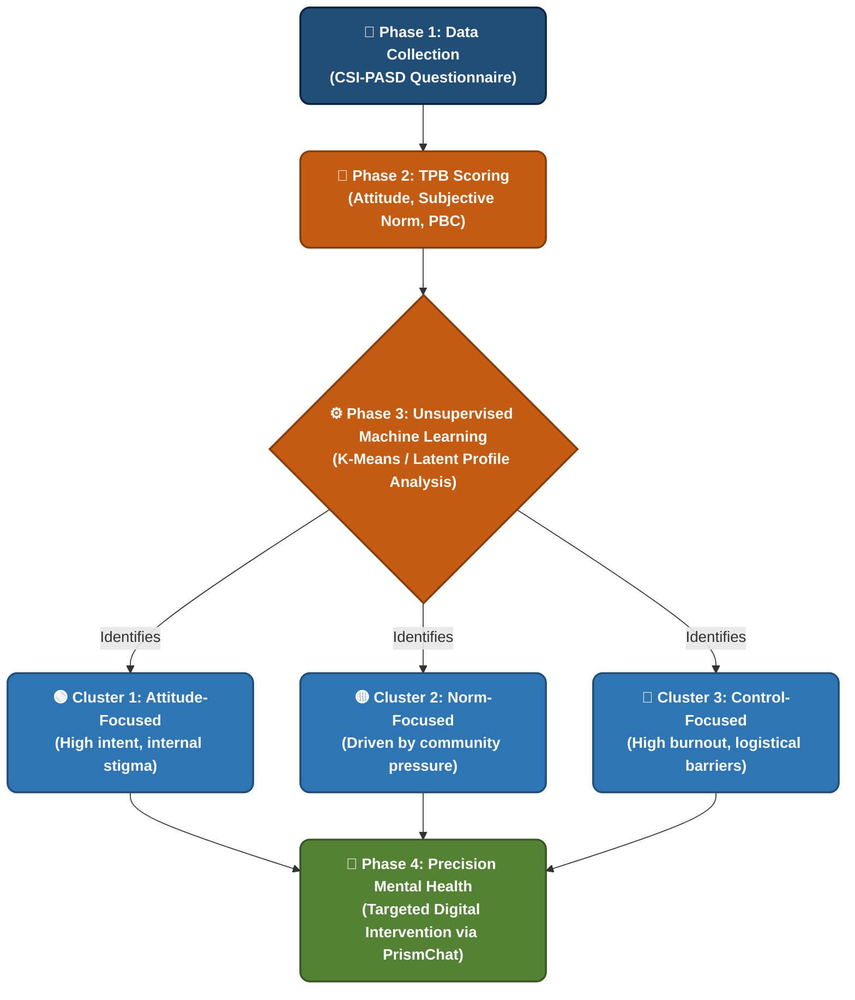

# 📊 Poster Data Analysis Flowchart

This is a **Mermaid Diagram**. It is the perfect visual to fill the large blank space in the middle of your UiTM academic poster. It visually explains to examiners and readers exactly how your data flows from the questionnaire into statistical clusters, and finally into the app intervention.

### How to use this for your poster:
1. Copy the code block below.
2. Go to the **[Mermaid Live Editor](https://mermaid.live/)** in your web browser.
3. Paste the code into the "Code" section on the left.
4. Click the **"Save"** or **"Export"** button (top right) and download it as a **PNG** or **SVG** image.
5. Insert that high-quality image directly into your poster template!

---

